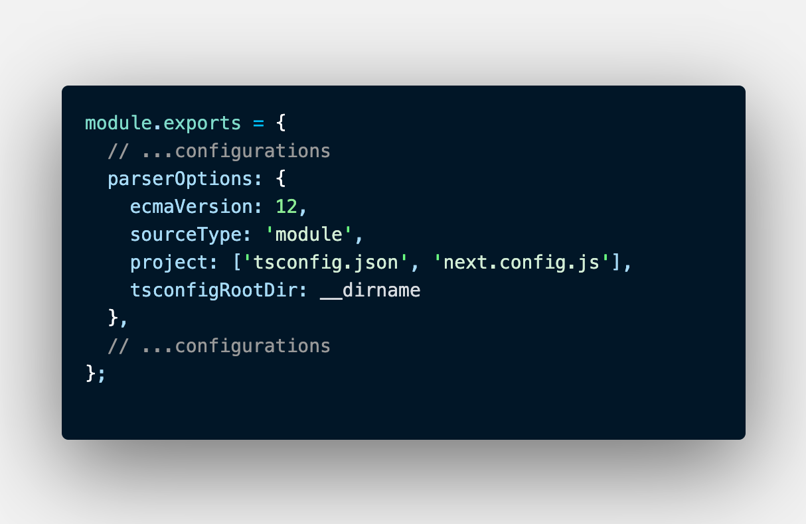

## 02 Mar 2022

### TodoList

- [x] install UI deps(antd, styled-component).
- [] setup docker in project.
- [] setup docker-compose at root project.

### Issue

**1**: 
eslint working not correctly when open project at root directory (outside ./cowardcade-main)

**solve**: 
change eslint from .json to .js to use __dirname param to set tsconfigRootDir in eslint.

