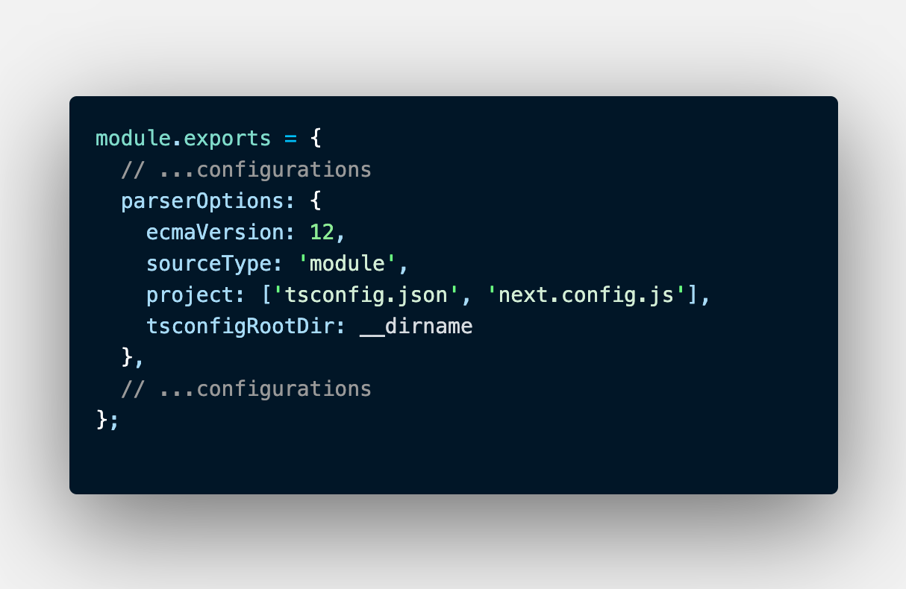

**Problem**: 
eslint working not correctly when open project at root directory (outside ./cowardcade-main)

**solve**: 
change eslint from .json to .js to use __dirname param to set tsconfigRootDir in eslint.

